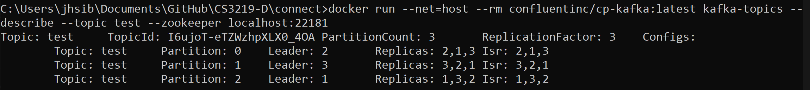
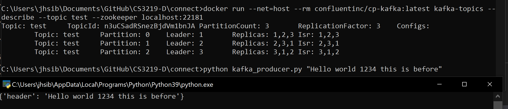
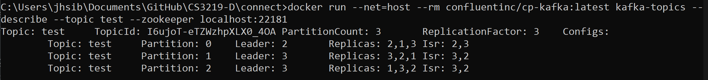
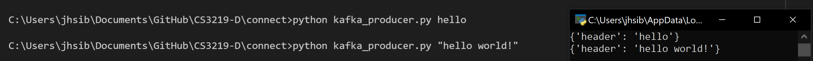

# CS3219 Task D

# Requirements
1. Python
2. `kafka-python` package
3. docker

# Steps to launch
## Windows
1. Run `1-setup_kafka.bat`
2. Wait for docker-compose to be up
3. Run `2-setup_cluster.bat`
4. The configuration of the kafka topic should be displayed on one screen while the `kakfa_consumer` is on another.
5. Run `python kafka_producer "<message>"` to send a message to kafka

## Mac
1. `cd setup`
2. Run `start docker-compose -f ./../setup/docker-compose.yml up` to launch kafka
3. Wait for docker compose to be up
4. Setup topic using `python ./kafka_admin.py`
5. Run consumer in a different window with `python ./kafka_consumer.py`
6. Run `python kafka_producer "<message>"` to send a message to kafka the message should appear at the consumer side
7. Run `./view_master.bat` to view the topic configuration

# Failure of master node

Each node is a leader of a partition

As expected, the producer is able to send messages to the consumer.

Now it is time to kill the master node

By killing the first node (kafka-1_1) and running the command again, we see that there is a new leader of the node. In this case kafka-3 has become the new leader of the partition

The producer is still able to send messages to the consumer after the master has failed